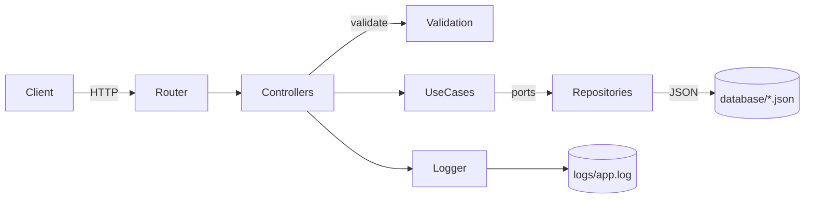

## Meli Test V2 — Backend API

### Overview
Node.js (ESM) + TypeScript Clean Architecture API for managing Products, Categories, and Sellers. Data is stored in JSON files under `database/`. Swagger docs are available.

### Architecture (Clean Architecture)
- **Domain**: Entities and repository interfaces (`src/domain/**`).
- **Application**: Use cases (one file per action) (`src/application/usecases/**`).
- **Presentation**: Input validation schemas with Zod (`src/presentation/validation/**`).
- **Infrastructure**: Express HTTP (controllers, routes, middlewares) and JSON repositories (`src/infra/**`).
- **Shared**: Logger singleton and Swagger JSON (`src/shared/**`).

Optional diagram (high-level):


### Key Decisions
- Separation of concerns per SOLID: each use case in its own file and folder.
- JSON-file repositories to match the provided `database/` seed data.
- Zod validations in Presentation layer; Domain remains persistence-agnostic.
- UUID v4 generated inside Create use cases; clients do not send IDs.
- Referential integrity enforced in use cases/controllers (e.g., product requires existing seller/category; prevents ID updates; restricts deletes in use when applicable).
- Request logging via Logger singleton to `logs/app.log` (most recent first on `/api/logs`).

### Setup
Prereqs: Node.js >= 18 and npm or yarn.

Install dependencies:
```bash
npm install
# or
yarn
```

### Run (Dev)
```bash
npm run dev
# or
yarn dev
```
Server: `http://localhost:3000`
Swagger UI: `http://localhost:3000/api-docs`

### Build and Start
```bash
npm run build && npm start
# or
yarn build && node dist/Main.js
```

### Testing
Jest + ts-jest.
```bash
npm test
# or
yarn test
```
Per-use-case unit tests live under `src/application/usecases/**/__tests__/**` and cover success/error paths.

### Main Endpoints
Base path: `/api`

- Categories
  - `GET /categories` — list
  - `GET /categories/:id` — get by id
  - `POST /categories` — create (body: `{ name }`)
  - `PUT /categories/:id` — update (name only; id immutable)
  - `DELETE /categories/:id` — delete (409 if category in use)

- Sellers
  - `GET /sellers` — list
  - `GET /sellers/:id` — get by id
  - `POST /sellers` — create (body: `{ name, email, phone, sales }`; email unique + valid)
  - `PUT /sellers/:id` — update (id immutable; email unique)
  - `DELETE /sellers/:id` — delete (409 if seller in use)

- Products
  - `GET /products` — list
  - `GET /products/:id` — get by id
  - `GET /products/details/:id` — aggregated details (product, seller, category, sellersProducts, recommendedProducts)
  - `GET /product/detais/:id` — alias path
  - `GET /products/category/:categoryId` — filter by category
  - `GET /products/seller/:sellerId` — filter by seller
  - `POST /products` — create (requires existing `sellerId` and `categoryId`; body fields include: `realUrl, name, price, quantity, sales, rating, condition, description, images, productFeatures`)
  - `PUT /products/:id` — update (id immutable; validates changed FKs)
  - `DELETE /products/:id` — delete

- Logs
  - `GET /logs` — returns request logs (newest first)

#### Explanation of product details


### Validations (Zod)
- Category: `name` required; unique name enforced in repository.
- Seller: `email` valid + unique; `name`, `phone`, `sales` required.
- Product: `name`, `price`, `realUrl`, `categoryId`, `sellerId`, `quantity`, `sales`, `rating`, `condition`, `description` required; `images` array of URLs; `productFeatures` object.
- IDs are generated server-side on create; not updatable.

### Data & Persistence
- JSON files in `database/` used as a simple KV store keyed by `id`.
- File repositories handle read/write with basic integrity checks.

### Project Structure (abridged)
```
src/
  Main.ts
  domain/
    entities/{Category.ts, Product.ts, Seller.ts, Index.ts}
    repositories/{CategoryRepository.ts, ProductRepository.ts, SellerRepository.ts, Index.ts}
  application/
    usecases/
      product/{CreateProduct.ts, UpdateProduct.ts, DeleteProduct.ts, ListProducts.ts, GetProductById.ts, GetProductsByCategory.ts, GetProductsBySeller.ts, GetProductDetails.ts}
      category/{CreateCategory.ts, UpdateCategory.ts, DeleteCategory.ts, ListCategories.ts, GetCategoryById.ts}
      seller/{CreateSeller.ts, UpdateSeller.ts, DeleteSeller.ts, ListSellers.ts, GetSellerById.ts}
  presentation/validation/{Product.ts, Category.ts, Seller.ts}
  infra/
    http/{Routes.ts, controllers/*.ts, middlewares/*.ts}
    repositories/{JsonFileRepository.ts, *Repository.ts}
  shared/{Logger.ts, swagger.json}
database/{product.json, category.json, seeler.json}
logs/app.log
```

### Notes
- ESM modules with `type: module` and tsx for dev (`npm run dev`).
- Swagger JSON is static at `src/shared/swagger.json`.
- Ensure Node 18+.


